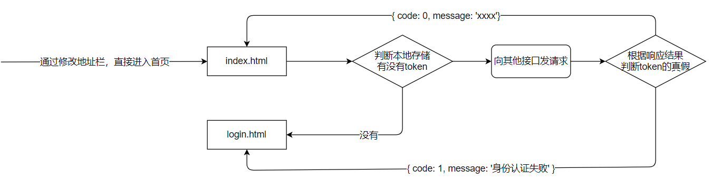

## 项目介绍123

- 应对现在数据可视化的趋势，越来越多企业需要在很多场景(营销数据，生产数据，用户数据)下使用，可视化图表来展示体现数据，让数据更加直观，数据特点更加突出。

- 项目以黑马班级管理为背景，功能包括学生信息录入，每次成绩录入；并制作可视化看板。

- 我们以班主任老师的角色注册账号，并登录系统。

- 为了方便开发，登录后点击页面顶部的“点我初始化数据”按钮，即可为该账号随机增加56名同学（8个小组，每组7人），并为每位学生模拟了3次考试成绩。

- 后续，可以在学员管理中，增删改学员信息，也可以录入或修改成绩。

## 重要的三个地址

- **接口文档地址**：https://docs.apipost.cn/preview/ebfa24f6d27e4f89/cf3af015f5ca6674
- **接口根路径**：http://www.itcbc.com:8000
- **线上演示地址**：http://www.itcbc.com:8888/login.html

## 资源说明

- 仓库地址：https://gitee.com/laotang1234/data-visualization-211025

  - master 默认模板
  - dev 包括完整功能

  ```bash
  # 克隆master分支
  git clone git@gitee.com:laotang1234/data-visualization-211025.git
  或
  git clone https://gitee.com/laotang1234/data-visualization-211025.git
  
  # 克隆dev分支
  git clone -b dev git@gitee.com:laotang1234/data-visualization-211025.git
  或
  git clone -b dev https://gitee.com/laotang1234/data-visualization-211025.git
  ```

## 课程目标

- 实战Ajax在项目中的应用
- 掌握echarts的基本使用
- 增强对数据的处理能力，增强编程能力

## Echarts-介绍

> ECharts，一个使用 JavaScript 实现的开源可视化库，可以流畅的运行在 PC 和移动设备上，兼容当前绝大部分浏览器（IE8/9/10/11，Chrome，Firefox，Safari等），底层依赖矢量图形库 [ZRender](https://github.com/ecomfe/zrender)，提供直观，交互丰富，可高度个性化定制的数据可视化图表。

大白话：

- 是一个JS插件
- 性能好可流畅运行PC与移动设备
- 兼容主流浏览器
- 提供很多常用图表，且可**定制**。

## Echarts-体验

官方教程：[五分钟上手ECharts](https://echarts.apache.org/handbook/zh/get-started/)

自己步骤：

- 下载echarts  https://echarts.apache.org/zh/download.html
- 引入echarts  `dist/echarts.min.js`
- 准备一个具备大小（宽高）的 DOM

```html
<div id="main" style="width: 600px;height:400px;"></div>
```

- 初始化echart实例

```js
var myChart = echarts.init(document.getElementById('main'));
```

- 指定图表的配置项和数据 (根据文档提供示例找到option)

```js
var option = {
    xAxis: {
        type: 'category',
        data: ['Mon', 'Tue', 'Wed', 'Thu', 'Fri', 'Sat', 'Sun']
    },
    yAxis: {
        type: 'value'
    },
    series: [{
        data: [820, 932, 901, 934, 1290, 1330, 1320],
        type: 'line'
    }]
};
```

- 使用刚指定的配置项和数据显示图表

```js
myChart.setOption(option);
```

## Echarts-基础配置

> 需要了解的主要配置：`series` `xAxis` `yAxis` `grid` `tooltip` `title` `legend` `color` 

- series
  - 系列列表。每个系列通过 `type` 决定自己的图表类型
  - 大白话：图标数据，指定什么类型的图标，可以多个图表重叠。
- xAxis：直角坐标系 grid 中的 x 轴
- yAxis：直角坐标系 grid 中的 y 轴
- grid：直角坐标系内绘图网格
- title：标题组件
- tooltip：提示框组件
- legend：图例组件
- color：调色盘颜色列表

演示代码：

```js
var option = {
    xAxis: {
        type: 'category',
        data: ['Mon', 'Tue', 'Wed', 'Thu', 'Fri', 'Sat', 'Sun']
    },
    yAxis: {
        type: 'value'
    },
    series: [{
        data: [820, 932, 901, 934, 1290, 1330, 1320],
        type: 'line',
        name:'线形图'
    },
    {
        data: [22, 333, 111, 222, 444, 666, 777],
        type: 'bar',
        name:'饼状图'
    }],
    grid: {
        show: true
    },
    title: {
        text: '标题'
    },
    tooltip: {
        padding: 20
    },
    legend: {
        data: ['线形图']
    },
    color: ['red','green']
};
```

## Echarts-饼图

### 步骤分析

1. 封装好函数，为后续传入真实数据做准备
2. 初始化echarts
3. 设置配置项，空的 option 即可
4. 创建图表
5. 查找官方示例
6. 按需求，自定义配置图表

### 第一步：echarts基本步骤

```js
function pieChart() {
  let myChart = echarts.init(document.querySelector('.pie'));
	let option = {};
	myChart.setOption(option);
}
```


### 第二步：参照官方示例

（官方示例：https://echarts.apache.org/examples/zh/editor.html?c=pie-roseType-simple）

- 只留下series系列数据配置，其他全部删除。

### 第三步：自定义配置

- 增加标题，标题颜色 #6d767e
- 增加鼠标移入提示。（比如：“各地学员分布  北京市  12人 占比6.8%”）
- 系列数据
  - 修改 name 为 '各地学员分布'
  - 饼图，内圈半径 10%，外圈半径 60%
  - 居中显示
  - 面积模式
  - 扇形轮廓圆角（4px）

完成后的配置项如下：

```js
let option = {
  tooltip: {
    // {a} 表示series中的name
    // {b} 表示数据中的series.data中的name
    // {c} 表示每一项的值
    // {d} 表示百分比
    formatter: '{a} <br />{b} <strong>{c}</strong>人 占比{d}%'
  },
  title: {
    text: '籍贯 Hometown',
    textStyle: {
      color: '#6d767e' // 标题演示
    },
  },
  series: [
    {
      name: '各地学员分布',
      type: 'pie', // pie 表示饼图
      radius: ['10%', '65%'], // 内外圈的半径
      center: ['50%', '50%'], // 中心点
      roseType: 'area', // area表示面积模式，radius表示半径模式
      itemStyle: { // 每一项的设置
        borderRadius: 4, // 扇形边缘圆角设置
      },
      data: [
        { value: 40, name: '北京' },
        { value: 38, name: '山东' },
        { value: 32, name: '上海' },
        { value: 30, name: '江苏' },
        { value: 28, name: '河北' },
        { value: 26, name: '山西' },
        { value: 22, name: '河南' },
        { value: 18, name: '辽宁' }
      ]
    }
  ]
};
```


## Echarts-折线图

### 步骤分析

1. 封装好函数，为后续传入真实数据做准备
2. 初始化echarts
3. 设置配置项，空的option 即可
4. 创建图表
5. 查找官方示例
6. 按需求，自定义配置图表

### 第一步：echarts基本步骤

```js
function lineChart() {
  let myChart = echarts.init(document.querySelector('.line'));
  let option = {};
  myChart.setOption(option);
}
```


### 第二步：参照官方示例

（官方示例：https://echarts.apache.org/examples/zh/editor.html?c=area-simple）

- tooltip -- 输入移入的提示
- title  --  标题
- xAxis  -- x轴
- yAxis  --  y轴
- dataZoom  --  数据缩放组件
- series  --  系列数据

以上配置项留下，其他删除

### 第三步：自定义配置

- 将官方示例中除了option之外的其他代码删除，并自己添加X轴数据和series中的数据。
- 系列数据
  - 增加一条线
  - 修改 name 为 '期望薪资' 和 '实际薪资'
  - 线的拐点为平滑拐点
  - 线条和X轴对齐位置，无特殊标记 `symbol: 'none'`

- 分析数据缩放组件 `dataZoom`
- 增加标题，标题颜色 #6d767e
- 分析tooltip（官方示例已带）。
- 增加图例，距离顶部20px。
- 分析坐标轴留白策略 `boundaryGap`

完成后的配置项 option 如下：

```js
let option = {
  // 图例
  legend: {
    top: 20,
  },
  // 鼠标移入的提示
  tooltip: {
    trigger: 'axis', // 轴触发
    position: function (pt) {
      // pt是一个数组，pt[0]表示横坐标位置，'10%'表示Y轴方向始终保持距离顶部10%的距离
      // 所以意思是，提示框的位置会跟随鼠标左右移动，但纵向上的位置始终保持不变。
      return [pt[0], '10%']; 
    }
  },
  // 标题
  title: {
    text: '薪资 Salary',
    textStyle: {
      color: '#6d767e'
    }
  },
  xAxis: {
    type: 'category',
    boundaryGap: false, // x轴两边的留白策略，false表示不留空白
    data: ['张三', '李四', '张飞', '赵云', '狗哥', '张三', '李四', '张飞', '赵云', '狗哥', '张三', '李四', '张飞', '赵云', '狗哥', '张三', '李四', '张飞', '赵云', '狗哥']
  },
  yAxis: {
    type: 'value',
    // Y轴类型为value，则留白策略指的是对数据的延伸。
    // 比如，图表中的数据最大值是17000，则Y轴最大数字大约是 17000 + 17000 * 50%
    boundaryGap: [0, '50%'],
  },
  // 数据缩放组件
  dataZoom: [
    // {
    //   type: 'inside', // 将拖动的条内置到轴里面，看不见了，但是可以拖动
    //   start: 0,
    //   end: 10
    // },
    {
      type: 'slider', // 拖动条显示到轴的外面（默认就是slider类型）
      start: 0, // 拖动滑块起始位置（这是一个百分比）
      end: 15 // 拖动滑块结束位置（这是一个百分比）
    }
  ],
  // 数据部分
  series: [
    {
      name: '期望薪资',
      type: 'line',
      smooth: true, // 表示使用平滑曲线
      symbol: 'none', // 线上拐点位置的样式，none表示没有；也可以是实心圆、空心圆、方块.....
      itemStyle: { // 单独控制这条线的颜色
        color: '#ee6666'
      },
      data: [8300, 9600, 15000, 17000, 12000, 8300, 9600, 15000, 17000, 12000, 8300, 9600, 15000, 17000, 12000, 8300, 9600, 15000, 17000, 12000]
    },
    {
      name: '实际薪资',
      type: 'line',
      smooth: true,
      symbol: 'none',
      itemStyle: { // 单独控制这条线的颜色
        color: '#5470c6'
      },
      data: [9600, 15000, 17000, 12000, 8300, 9600, 15000, 17000, 12000, 8300, 9600, 15000, 17000, 12000, 8300, 9600, 15000, 17000, 12000, 13000]
    }
  ]
};
```


## Echarts-柱状图

### 步骤分析

1. 封装好函数，为后续传入真实数据做准备
2. 初始化echarts
3. 设置配置项，空的option 即可
4. 创建图表
5. 查找官方示例
6. 按需求，自定义配置图表

### 第一步：echarts基本步骤

```js
function barChart() {
  let myChart = echarts.init(document.querySelector('.barChart'));
  let option = {}
  myChart.setOption(option);
}
```


### 第二步：参照官方示例

（官方示例：https://echarts.apache.org/examples/zh/editor.html?c=mix-line-bar）

- tooltip 提示组件
- legend 图例
- xAxis x轴
- yAxis y轴
- series 系列数据

以上几个配置项留下，其他删除。

### 第三步：自定义配置

- 修改X轴及series中的数据

  ```js
  ['1组', '2组', '3组', '4组', '5组', '6组', '7组']
  [83, 57, 90, 78, 66, 76, 77, 87, 69, 92, 88, 78]
  [2, 1, 3, 4, 2, 5, 2, 2, 4, 1, 6, 2]
  [3, 2, 1, 5, 1, 2, 3, 4, 5, 2, 2, 4]
  [3, 2, 1, 5, 1, 2, 3, 4, 5, 2, 2, 4]
  ```

- 多个Y轴
  - 第一个y轴（**索引0**）表示平均分，范围0~100，根据数字10，将Y轴分为10份
  - 第二个y轴（**索引1**）表示人数，范围0~10（根据班级情况而定），根据数字1，将y轴分为10份。
- 系列数据
  - 增加至 4 组数据，并修改每组 name 
  - 修改每个柱子的宽度为 15px
  - 让平均分使用第一个Y轴（`yAxisIndex: 0`），让人数使用第二个Y轴（`yAxisIndex: 1`）
- 调整网格（图表的宽高）
  - 上下 30px，左右 7%
- 分析tooltip（官方示例已带）

```js
let option = {
  // 网格（整个图表区域设置）
  grid: {
    top: 30,
    bottom: 30,
    left: '7%',
    right: '7%'
  },
  // 鼠标移入的提示
  tooltip: {
    trigger: 'axis', // 触发方式，axis表示轴触发，item表示每一项
    axisPointer: {   // 坐标轴指示器配置项
      // 十字准星指示器，其他选项有 line、shadow、none（这里配合x轴的设置，组成的十字准星）
      type: 'cross', 
      crossStyle: {
        color: '#999'
      }
    }
  },
  // 图例
  legend: {},
  // X轴
  xAxis: [
    {
      type: 'category',
      data: ['1组', '2组', '3组', '4组', '5组', '6组', '7组'],
      axisPointer: { // 坐标轴指示器为阴影，配合tooltip中的设置，组成十字准星
        type: 'shadow'
      }
    }
  ],
  // Y轴
  yAxis: [
    {
      type: 'value',
      min: 0, // y轴数据最小值
      max: 100, // y轴数据最大值
      interval: 10, // step步长，把y轴的数据分成多少份
      axisLabel: { // Y轴文字设置
        formatter: '{value}分', // Y轴文字
      }
    },
    {
      type: 'value',
      min: 0,
      max: 10,
      interval: 1,
      axisLabel: {
        formatter: '{value}人'
      }
    }
  ],
  // 数据部分（4组数据）
  series: [
    {
      name: '平均分',
      type: 'bar',
      data: [83, 57, 90, 78, 66, 76, 77, 87, 69, 92, 88, 78],
      barWidth: '15',
    },
    {
      name: '低于60分人数',
      type: 'bar',
      data: [2, 1, 3, 4, 2, 5, 2, 2, 4, 1, 6, 2],
      barWidth: '15',
      yAxisIndex: 1, // Y轴索引，1表示使用第2个Y轴
    },
    {
      name: '60到80分之间',
      type: 'bar',
      yAxisIndex: 1, // Y轴索引，1表示使用第2个Y轴
      barWidth: '15',
      data: [1, 4, 2, 4, 5, 2, 1, 3, 3, 2, 2, 4]
    }
    ,
    {
      name: '高于80分人数',
      type: 'bar',
      yAxisIndex: 1, // Y轴索引，1表示使用第2个Y轴
      barWidth: '15',
      data: [3, 2, 1, 5, 1, 2, 3, 4, 5, 2, 2, 4]
    }
  ]
};
```


## Echarts社区

> 社区就是一些，活跃的echart使用者，交流和贡献定制好的图表的地方。

在这里可以找到一些基于echart的高度定制好的图表，相当于基于jquery开发的插件，这里是基于echarts开发的第三方的图表。

社区示例：https://www.makeapie.com/explore.html


## Echarts-使用社区的示例

项目中使用的社区示例地址：https://www.makeapie.com/editor.html?c=xD4a1EBnvW

重点：

- 使用社区示例，必须要查看示例引入了哪些外部js文件。

实现步骤：

- 第一需要下载china.js提供中国地图的js文件
- 导入后，直接使用社区提供的配置即可。
- 自行修改
  - 将背景色改为 白色
  - 将 视觉映射组件（`visualMap`）中的 `show` 改为 `false`
  - 其他自行自愿修改。

必须知道的结论：

- 哪些数据和哪些数据是对应的，必须一致
- 哪些数据能多，能错
- 哪些数据不能多，不能错

## 插件介绍

### 表单验证插件

- 表单验证插件有很多，不同的框架中选择的也不一样。
- 案例中，表单验证使用的是 [bootstrapValidator](https://gitee.com/psccja/bootstrapvalidator) 插件。（链接挂的是码云仓库地址）
- 网上有很多关于它的介绍，比如[这里](https://www.zhuangyan.cn/BootstrapValidator-guide/) 和 [这里](https://www.yisu.com/zixun/153358.html)。
- 经过整理，总结它的使用步骤如下：

使用步骤：

1. 先引入bootstrap.css 、jquery.js 和 bootstrap.js 

2. 引入 bootstrapValidator.css 和 bootstrapValidator.js 

3. 编写验证代码，为了方便，可以封装进一个函数

   ```js
   // 比如，验证一个用户名和密码
   function test() {
     return {
       fields: {
         username: { // 这里username是 input 的name属性值，表示对这个输入框进行验证
           validators: {
             notEmpty: {   //不能为空
               message: '用户名不能为空.'
             },
             stringLength: {   //检测长度
               min: 2,
               max: 15,
               message: '用户名需要2~15个字符'
             }
           }
         },
         password: {
           validators: {
             notEmpty: {
               message: '密码不能为空'
             },
             stringLength: {   //检测长度
               min: 6,
               max: 15,
               message: '密码需要6~15个字符'
             }
           }
         }
       }
     }
   }
   ```

4. 使用插件语法，监听表单提交事件，并使用验证

   ```js
   // 语法：
   // $('表单').bootstrapValidator(上面的验证函数()).on('success.form.bv', function (e) {}
   
   // 比如，注册
   $('.register form').bootstrapValidator(test()).on('success.form.bv', function (e) {
       e.preventDefault();
       // 通过验证，这里的代码将会执行。我们将Ajax请求的代码放到这里即可
   });
   ```

   

### 提示框插件

- 提示框插件有很多，不同的框架中选择的也不一样。
- 案例中，提示框使用的是 [toastr](https://codeseven.github.io/toastr/demo.html) 插件。(挂的是GitHub链接，可能打不开)
- 总结它的使用步骤如下：

使用步骤：

1. 加载 toastr.css 和 toastr.js 文件

2. 全局配置。为方便，我们将下面的配置放到 assets/utils/toastr.js 中，使用时，加载这个配置文件即可

   ```js
   toastr.options = {
     // "closeButton": false,
     // "debug": false,
     // "newestOnTop": false,
     // "progressBar": false,
     "positionClass": "toast-top-right", // 提示框位置，这里填类名
     // "preventDuplicates": false,
     // "onclick": null,
     "showDuration": "300",              // 提示框渐显所用时间
     "hideDuration": "300",              // 提示框隐藏渐隐时间
     "timeOut": "2000",                  // 提示框持续时间
     // "extendedTimeOut": "1000",
     // "showEasing": "swing",
     // "hideEasing": "linear",
     // "showMethod": "fadeIn",
     // "hideMethod": "fadeOut"
   }
   ```

3. 调用方法，直接使用

   ```js
   toastr.info('提示信息');                // 普通提示
   toastr.success('提示信息');             // 成功提示
   toastr.warning('提示信息');             // 警告提示
   toastr.error('提示信息');               // 错误提示
   ```

   

## 配置Axios项目根路径

- 目前echarts图表中的数据都是假数据

- 如果获取真数据就需要调用接口

- 这就需要至少要完成注册、登录、初始化数据等接口的调用才行

- 项目中接口根路径是相同的，见前文 [重要的三个地址](##重要的三个地址) 

- 所以，在 `assets/utils` 文件夹，创建axios的配置文件，取名 `request.js` 。代码如下：

  ```js
  axios.defaults.baseURL = 'http://www.itcbc.com:8000';
  ```

  > 这里之所以放到 assets/utils 文件夹中，是因为 utils 在编程中常用来放工具函数。而request是请求的意思。

## 注册账号

### 切换登录和注册的盒子

登录和注册同在 login.html 中，因为定位的原因重叠在一起了。我们可以通过JS实现切换两个盒子

```js
// 切换两个盒子
$('.box a').on('click', function () {
    $(this).parents('.box').hide().siblings('.box').show();
})
```

### 表单验证

- 表单验证，见上文的 [插件介绍](##插件介绍) 中的 [表单验证插件](###表单验证插件) 。（这里的示例可以直接当做注册和登录的验证代码）

### 完成注册

当表单验证通过后，根据接口文档，获取输入框的账号和密码，Ajax提交账号和密码

```js
$('.register form').bootstrapValidator(register()).on('success.form.bv', function (e) {
  e.preventDefault();
  // 通过验证，这里的代码将会执行。我们将Ajax请求的代码放到这里即可
  let data = $(this).serialize();
  // console.log(data);
  axios.post('/api/register', data).then(({ data: res }) => {
    // console.log(res);
    if (res.code === 0) { // 我们只考虑成功的情况即可，失败的情况后续统一使用拦截器处理
      toastr.success(res.message); // 使用插件提示消息
      $('.register input').val(''); // 清空输入框
      $('.register').hide().next().show(); // 切换至登录的盒子
    }
  })
});
```

## 登录功能

- 因为前文已经完成了注册，所以这里的登录功能极为简单
- 问题是，登录如果成功，该做什么？
  - 将服务器响应的token存储到本地存储（关于token的说明见下文的 [JWT身份认证](##JWT身份认证)）
  - 跳转到 index.html 页面 （页面跳转，只考虑两个html之间的相对关系，不考虑js在哪里）

登录的代码如下：

```js
$('.login form').bootstrapValidator(register()).on('success.form.bv', function (e) {
    e.preventDefault();
    //提交逻辑
    // console.log(222);
    let data = $(this).serialize();
    // console.log(data);
    axios.post('/api/login', data).then(({ data: res }) => {
        // console.log(res);
        if (res.code === 0) {
            localStorage.setItem('token', res.token);
            location.href = './index.html'
        }
    })
});
```

## JWT身份认证

### 什么是jwt身份认证

在前后端分离模式的开发中，服务器如何知道来访者的身份呢？

- 在登录后，服务器会响应给用户一个 令牌 （token）
- 令牌中会包括该用户的id等唯一标识
- 浏览器收到令牌后，自己保存
- 下次请求其他接口时，（在请求头中）携带这个令牌去请求
- 这样服务器就知道来访者的身份了，服务器就会为该用户开发接口的访问权限，并处理该用户的数据


> 这样，就明白为什么登录后，要将token保存到本地存储中了。

### 全局配置请求头

由于除了登录和注册接口外，其他所有接口都需要身份认证（都需要我们提供令牌），所以我们可以在 `request.js` 中，全局配置请求头。

```js
axios.defaults.headers.common['Authorization'] = localStorage.getItem('token');
```

### 利用令牌控制页面的访问权限

浏览器端，可以通过合理使用令牌，控制页面的访问权限。

比如，用户默认只能访问登录页，如果不登录就不能访问首页，怎么做？



**第一个判断**：判断本地存储是否有token

```html
<!-- index.html -->
<!-- 本地存储有token，则说明用户登录了；没有token，则说明用户没有登录，不允许访问首页 -->
<script>
  if (localStorage.getItem('token') === null) location.href = './login.html'
</script>
```

> 上述判断只能判断token有没有，但不能判断token的真假，所以需要发送Ajax请求，根据服务器响应结果再次判断

**第二个判断**：根据服务器响应结果，判断token是否是假token或者过期的token

- 如果token值是正确的，是没有过期的，则服务器响应 `code===0`
- 如果token是错误的获取过期的，则服务器响应 `code===1 && message==='身份认证失败'`

```js
// request.js 中，使用响应拦截器，拦截响应结果进行判断
// 如果响应结果中 code === 1 && message === '身份认证失败' 则表示浏览器使用了无效的token
// 添加响应拦截器
axios.interceptors.response.use(function (response) {
    // 对响应数据做点什么
    return response;
}, function (error) {
    // 对响应错误做点什么
    if (error.response) {
        if (error.response.data.message === '身份认证失败') {
            localStorage.removeItem('token');
            location.href = './login.html'
        }
    }
    return Promise.reject(error);
});
```

## 统一处理错误提示

在上述响应拦截器的基础之上，顺便添加响应错误提示。

所有接口响应的结果有两种：

- 响应状态码 小于 400，并且 `code===1`，比如登录账号密码错误。这样的响应进入响应拦截器中的第一个函数。
- 响应状态码 大于等于 400，并且 `code === 1` ，比如身份认证失败。这样的响应进入响应拦截器中的第二个函数。

所以分别提示

```diff
// request.js 中，使用响应拦截器，拦截响应结果进行判断
// 如果响应结果中 code === 1 && message === '身份认证失败' 则表示浏览器使用了无效的token
// 添加响应拦截器
axios.interceptors.response.use(function (response) {
    // 对响应数据做点什么
+    if (response.data.code === 1) {
+        toastr.warning(response.data.message)
+    }
    return response;
}, function (error) {
    // 对响应错误做点什么
    if (error.response) {
        if (error.response.data.message === '身份认证失败') {
            localStorage.removeItem('token');
            location.href = './login.html'
-        }
+        } else {
+            toastr.error(error.response.data.message);
+        }
    }
    return Promise.reject(error);
});
```


## 退出登录

一般来说，退出需要做的事和登录后做的事刚好相反。

- 登录后，在本地存储了token；退出时，移除这个token
- 登录后，跳转到了 index.html 页面；退出时，跳转到 login.html

```js
// ------------------------ 退出登录 -------------------
$('.logout a').on('click', function () {
  if (!confirm('确定要退出登录吗？')) return;
  localStorage.removeItem('token');
  location.href = './login.html';
})
```

## 初始化数据

为了减少手动录入数据的时间，特别设计了此接口。调用此接口将为你随机添加56名同学，并分为8个组。并为每位同学随机添加了三次成绩。

```js
// ------------------------ 初始化数据 -------------------
$('.init').on('click', function () {
  axios.get('/init/data').then(({ data: res }) => {
    if (res.code === 0) {
      toastr.success(res.message);
    }
  })
})
```

## 班级概况

- 查阅接口文档，发现服务器已经将数据计算整理完毕，提供了现成的接口。
- 所以我们前端开发者，只需要调用接口，并将数据展示到页面中即可。

```js
// 获取班级概况数据
axios.get('/student/overview').then(({ data: res }) => {
  // console.log(res);
  let { code, data } = res;
  if (code === 0) {
    $('.overview .total').text(data.total);
    $('.overview .avgAge').text(data.avgAge);
    $('.overview .avgSalary').text(data.avgSalary);
    $('.overview .proportion').text(data.proportion);
  }
})
```

## 柱状图使用接口数据

- 这个接口和班级概况一样，服务器已经将数据整理完毕。
- 所以我们前端开发者，只需要调用接口获取数据，并将数据传递给 echarts 即可。
- 不过，接口需要一个 batch 参数（考试的次数），所以需要先将下拉菜单处理一下。

```js
// 下拉菜单
$('.bar .btn').on('click', function () {
  $(this).next('ul').toggle();
})

// 点击 “第n次成绩” 按钮，获取该次考试成绩
$('#batch li').on('click', function () {
  // 取得当前li元素在兄弟间的位置，即索引，加1后，刚好当做考试次数
  let batch = $(this).index() + 1; 
  $(this).parent().hide(); // 让ul列表隐藏，这行也可以省略，即不隐藏
  axios.get('/score/batch', { params: { batch } }).then(({ data: res }) => {
    let { data, code } = res;
    if (code === 0) {
      // console.log(data);
      barChart(data);
    }
  })
})

// 页面加载后，触发第一个li的单击事件
$('#batch li').eq(0).trigger('click');
```

创建柱状图的函数，设置形参接收数据。并把数据应用到X轴及series中。

```diff
// 形参，直接解构赋值
+function barChart({ avgScore, group, gt60, gt80, lt60 }) {
  ...... 省略其他代码
  let option = {
    xAxis: {
      type: 'category',
+      data: group, // X轴使用组名 1组 2组 3组 ......
    },
    series: [
      {
+      data: avgScore, // 第一个柱子，使用平均分
        type: 'bar',
        barWidth: '15%',
        name: '平均分',
        yAxisIndex: 0,
      },
      {
+      data: lt60, // 第二个柱子，使用小于60分人数数据
        type: 'bar',
        barWidth: '15%',
        name: '低于60分人数',
        yAxisIndex: 1,
      },
      {
+      data: gt60, // 第三个柱子，使用大于60小于80分人数数据
        type: 'bar',
        barWidth: '15%',
        name: '60~80分人数',
        yAxisIndex: 1,
      },
      {
+      data: gt80, // 第四个柱子，使用大于80分人数数据
        type: 'bar',
        barWidth: '15%',
        name: '80分以上人数',
        yAxisIndex: 1,
      }
    ]
  }
}

- barChart(); // 这里就不要再调用函数了
```

## 折线图使用接口数据

> 为了断链数据处理能力。所以并没有提供 “返回折线图数据” 的接口。我们需要调用获取学生接口，然后自己处理数据。

调用“获取学生”接口，然后处理

```js
// 获取学员信息  ==> 1、提取期望薪资和实际薪资，做折线图;  2、提取地区，做饼图;  3、提取地区和经纬度，做地图
axios.get('/student/list').then(({ data: res }) => {
  let { code, data } = res;
  if (code === 0) {
    // console.log(data);
    // 折线图所需数据，检查折线图需要的数据格式
    // (x轴需要一个数组，放姓名)
    // (两条线分别需要一个数组，放期望薪资和实际薪资)
    let lineData = {
      xAxis: [],
      salary: [],
      truesalary: []
    };
    // 遍历data，将所需的数据取出，放到前面定义好的数组中
    data.forEach(item => {
      lineData.xAxis.push(item.name);
      lineData.salary.push(item.salary);
      lineData.truesalary.push(item.truesalary);
    });
    
    // 遍历结束，得到我们所需的数据
    // 数据处理好，调用图表函数
    lineChart(lineData);
  }
})
```

折线图函数 lineChart 中，设置形参接收数据并使用。

```diff
+function lineChart({ xAxis, salary, truesalary }) {
  let myChart = echarts.init($('.line')[0]);
  let option = {
    ...... 其他配置项省略
    xAxis: {
      type: 'category',
      boundaryGap: false,
+      data: xAxis
    },
    // 数据部分
    series: [
      {
        name: '期望薪资',
        type: 'line',
        smooth: true, // 表示使用平滑曲线
        symbol: 'none', // 线上拐点位置的样式，none表示没有；也可以是实心圆、空心圆、方块.....
        itemStyle: { // 单独控制这条线的颜色
          color: '#ee6666'
        },
+        data: salary
      },
      {
        name: '实际薪资',
        type: 'line',
        smooth: true,
        symbol: 'none',
        itemStyle: { // 单独控制这条线的颜色
          color: '#5470c6'
        },
+        data: truesalary
      }
    ]
  };
  myChart.setOption(option);
}
- lineChart(); // 这里不要再调用函数了
```

## 地图使用接口数据

地图中使用的数据，只有地名和经纬度。这些数据在 “获取学生”接口中都有，但还是需要我们自己整理。锻炼数据处理能力。

由于前面已经调用过获取学生接口了，所以不用重新发送请求获取数据了，只需要处理即可。

```js
// 分析地图需要什么格式的数据。
// 需要两组数据
// 第一组数据
let chinaGeoCoordMap = {
  '北京市': [116.4551, 40.2539],
  '内蒙古': [110.3467, 41.4899],
   "吉林": [125.8154, 44.2584],
  // ......
}
// 第二组数据
let chinaDatas = [
  [{
    name: '黑龙江11',
    value: 0
  }], [{
    name: '内蒙古',
    value: 0
  }],
  // ......
]
```

> 上述数据，用的是省的名字，实际上全部用市的名字或者县的名字都可以。只要对应上即可。
>
> **我们案例中用县的名字。**

当请求到学生数据之后

```diff
// 获取学员信息  ==> 1、提取期望薪资和实际薪资，做折线图;  2、提取地区，做饼图;  3、提取地区和经纬度，做地图
axios.get('/student/list').then(({ data: res }) => {
  let { code, data } = res;
  if (code === 0) {
    // console.log(data);
    // 折线图所需数据，检查折线图需要的数据格式
    // (x轴需要一个数组，放姓名)
    // (两条线分别需要一个数组，放期望薪资和实际薪资)
    let lineData = {
      xAxis: [],
      salary: [],
      truesalary: []
    };
+    // 地图，第一组数据
+    let chinaGeoCoordMap = { '北京市': [116.4551, 40.2539] };
+    // 地图，第二组数据
+    let chinaDatas = []
    // 遍历data，将所需的数据取出，放到前面定义好的数组中
    data.forEach(item => {
      lineData.xAxis.push(item.name);
      lineData.salary.push(item.salary);
      lineData.truesalary.push(item.truesalary);
      
+      chinaGeoCoordMap[item.county] = [item.jing, item.wei];
+      chinaDatas.push([{name: item.county, value: 0}]);
    });
    
    // 遍历结束，得到我们所需的数据
    // 数据处理好，调用图表函数
    lineChart(lineData);
+    mapChart(chinaGeoCoordMap, chinaDatas);
  }
})
```

地图函数中使用数据：

```diff
+function mapChart(chinaGeoCoordMap, chinaDatas) {
- var chinaGeoCoordMap = {.......}
- var chinaDatas = [......]
  let myChart = echarts.init($('.map')[0]);
  var convertData = function (data) {
    var res = [];
    for (var i = 0; i < data.length; i++) {
      var dataItem = data[i];
      var fromCoord = chinaGeoCoordMap[dataItem[0].name];
+      var toCoord = [116.4551, 40.2539]; // 目标点 经纬度（北京市）
      if (fromCoord && toCoord) {
        res.push([{
          coord: fromCoord,
          value: dataItem[0].value
        }, {
          coord: toCoord,
        }]);
      }
    }
    return res;
  };
  var series = [];
+  [['北京市', chinaDatas]].forEach(function (item, i) { // 写好北京市，目标点
   // 其他代码省略，无需修改 
}

- mapChart(); // 这里不要再调用函数了
```

## 饼图使用接口数据

饼图使用的数据格式如下

```js
data: [
  { name: '河北省', value: 12 },
  { name: '广东省', value: 12 },
  { name: '上海市', value: 12 },
  { name: '江西省', value: 12 },
  // ......
]
```

饼图使用的数据，也需要通过 获取学生 接口得到，并需要自行处理。

```diff
// 获取学员信息  ==> 1、提取期望薪资和实际薪资，做折线图;  2、提取地区，做饼图;  3、提取地区和经纬度，做地图
axios.get('/student/list').then(({ data: res }) => {
  let { code, data } = res;
  if (code === 0) {
    // console.log(data);
    // 折线图所需数据，检查折线图需要的数据格式
    // (x轴需要一个数组，放姓名)
    // (两条线分别需要一个数组，放期望薪资和实际薪资)
    let lineData = {
      xAxis: [],
      salary: [],
      truesalary: []
    };
    // 地图，第一组数据
    let chinaGeoCoordMap = { '北京市': [116.4551, 40.2539] };
    // 地图，第二组数据
    let chinaDatas = []
    
+    // 饼图数据
+    let pieData = [];
    
    // 遍历data，将所需的数据取出，放到前面定义好的数组中
    data.forEach(item => {
      lineData.xAxis.push(item.name);
      lineData.salary.push(item.salary);
      lineData.truesalary.push(item.truesalary);
      
      chinaGeoCoordMap[item.county] = [item.jing, item.wei];
      chinaDatas.push([{name: item.county, value: 0}]);
      
+      let i;
+      if ((i = pieData.findIndex(v => v.name === item.province)) >= 0) {
+        pieData[i].value++;
+      } else {
+        pieData.push({ name: item.province, value: 1 });
+      }
    });
    
    // 遍历结束，得到我们所需的数据
    // 数据处理好，调用图表函数
    lineChart(lineData);
    mapChart(chinaGeoCoordMap, chinaDatas);
+    pieChart(pieData);
  }
})
```

饼图函数，接收数据并使用：

```diff
+function pieChart(pieData) {
  let myChart = echarts.init($('.pie')[0]);
  let option = {
    series: [
      {
        name: '各地人员分布',
        type: 'pie', // pie 表示饼图
        radius: ['10%', '65%'], // 内外圈的半径
        center: ['50%', '50%'], // 中心点
        roseType: 'area', // area表示面积模式，radius表示半径模式
        itemStyle: { // 每一项的设置
          borderRadius: 4, // 扇形边缘圆角设置
        },
+        data: pieData
      }
    ]
  };
}

```

## 成绩管理

> 后续，就是我们在Ajax课程中学习的知识点了。也就是数据的增删改查等等操作。

### 获取成绩并展示

这个功能有对应的接口，而且得到的数据不需要处理，直接可以使用。**认真阅读接口文档**。

```js
// -------------- 获取分数，展示列表 ------------
function renderScore() {
  axios.get('/score/list').then(({ data: res }) => {
    // console.log(res);
    let { code, data } = res;
    if (code === 0) {
      let arr = [];
      for (let key in data) {
        arr.push(`
          <tr>
              <th scope="row">${key}</th>
              <td>${data[key].name}</td>
              <td class="score">${data[key].score[0]}</td>
              <td class="score">${data[key].score[1]}</td>
              <td class="score">${data[key].score[2]}</td>
              <td class="score">${data[key].score[3]}</td>
              <td class="score">${data[key].score[4]}</td>
          </tr>
          `);
      }

      $('tbody').html(arr.join(''))
    }
  })
}
renderScore();
```

### 可编辑的表格效果

添加和修改成绩，并没有使用弹出层等效果。而是采用可编辑的表格。

可编辑的表格，需要用到的技术就是DOM操作，没有其他。

思路如下：

- 点击单元格 `td.score` ，获取单元格的值。
- 创建input
- 设置input的样式和td的样式一致，或者自行修改样式。
- 将 单元格的值 设置为 input 的 value
- 将 input 放入 td 中，并获取焦点

后续补充，输入框中按回车，表示确定，失去焦点表示取消

- 给input注册 keyup 和 blur 事件。

完整代码：

```js
// 可编辑的表格
$('tbody').on('click', '.score', function () {
  let td = $(this);
  if (td.children().length > 0) return; // 判断如果已经有input了，就不要在重复添加input了
  let text = td.text(); // 保存td中的分数
  td.html(''); // 设置td的内容为空
  let input = $('<input />'); // 创建input
  input // 设置input的样式
    .css('color', td.css('color')) // 设置input的color和td的color相同
    .css('background-color', td.css('background-color'))
    .css('font-size', td.css('font-size'))
    .css('width', '100%')
    .css('height', '100%')
    .css('outline', 'none')
    .css('border', 'none')
    .val(text) // 将原来td中的值，设置为input的value
    .appendTo(td) // 将input添加到td中
    .focus(); // 让input获取焦点，即有光标闪烁效果

  // 为input注册 keyup 事件
  input.on('keyup', function (e) {
    if (e.keyCode === 13) {
      // console.log('按下回车键，这里调用接口，修改或录入成绩');
    }
  })
  // 为input注册blur事件
  input.on('blur', function () {
    td.html(text); // 失去焦点后，将原来td的值设置回去
  })
})
```

### 修改或录入成绩

接口分析：

- 需要学员id 参数
- 需要batch次数 参数
- 需要score成绩 参数

所以，在循环遍历数据时，将需要的 **学员id** 和 **batch**次数，用自定义属性 data-xx 存储。

```js
arr.push(`
  <tr>
      <th scope="row">${key}</th>
      <td>${data[key].name}</td>
      <td data-batch="1" data-id="${key}" class="score">${data[key].score[0]}</td>
      <td data-batch="2" data-id="${key}" class="score">${data[key].score[1]}</td>
      <td data-batch="3" data-id="${key}" class="score">${data[key].score[2]}</td>
      <td data-batch="4" data-id="${key}" class="score">${data[key].score[3]}</td>
      <td data-batch="5" data-id="${key}" class="score">${data[key].score[4]}</td>
  </tr>
```

当按下回车键后，获取接口所需参数，调用接口发送请求，进行成绩的修改和录入

```js
input.on('keyup', function (e) {
  if (e.keyCode === 13) {
    // console.log('按下回车键，这里调用接口，修改或录入成绩');
    let score = $(this).val();
    if (isNaN(score) || score < 0 || score > 100) {
      return toastr.warning('请输入0~100之间的数字');
    }
    let stu_id = td.data('id');
    let batch = td.data('batch');
    // console.log(score, stu_id, batch);
    axios.post('/score/entry', { score, stu_id, batch }).then(({ data: res }) => {
      if (res.code === 0) {
        toastr.success(res.message);
        td.html(score) // 修改成功后，将新的成绩 放到 td 中
      }
    })
  }
})
```


## 学员管理

### 获取数据展示

这也是一个常规操作，按照接口文档获取数据，然后循环遍历到表格中即可。

```js
// 获取学员数据
function renderStudent() {
  axios.get('/student/list').then(({ data: res }) => {
    // console.log(res);
    if (res.code === 0) {
      let arr = [];
      res.data.forEach(item => {
        arr.push(`
          <tr>
              <th scope="row">${item.id}</th>
              <td>${item.name}</td>
              <td>${item.age}</td>
              <td>${item.sex}</td>
              <td>${item.group}</td>
              <td>${item.phone}</td>
              <td>${item.salary}</td>
              <td>${item.truesalary}</td>
              <td>${item.province}${item.city}${item.county}</td>
              <td>
              <button type="button" class="btn btn-primary btn-sm update">修改</button>
              <button type="button" class="btn btn-danger btn-sm del">删除</button>
              </td>
          </tr>
          `);
      });
      $('tbody').html(arr.join(''))
    }
  })
}
renderStudent();
```

### 添加 -- 分析

- 添加使用了 bootstrap4 的[模态框](https://v4.bootcss.com/docs/components/modal/)（弹出框），这个只需按 bootstrap 的语法写即可。
- 表单中有“省市县”联动效果。当然也有对应的接口。
  - 开始时，先获取所有的省，放到第一个下拉框中
  - 当“省”切换的时候，获取对应的市，并放入第二个下拉框中。
  - 当“市”切换的时候，获取对应的县，并放入第三个下拉框中
- 需要有表单验证，这个安装表单验证插件的语法写即可。
- 一切准备就绪，提交表单数据，完成添加即可。

### 添加 -- 省市县联动

```js
// --------------------- 获取省 ---------------------
axios.get('/geo/province').then(({ data: res }) => {
  // console.log(res);
  let arr = ['<option selected value="">--省--</option>'];
  res.forEach(item => {
    arr.push(`<option value="${item}">${item}</option>`)
  });
  $('select[name=province]').html(arr.join(''))
})

// --------------------- 省切换的时候，选择市 ---------------------
$('select[name=province]').on('change', function () {
  // 重置县
  $('select[name=county]').html(`<option selected value="">--县--</option>`);
  let pname = $(this).val();
  axios.get('/geo/city', { params: { pname } }).then(({ data: res }) => {
    // console.log(res);
    let arr = ['<option selected value="">--市--</option>'];
    res.forEach(item => {
      arr.push(`<option value="${item}">${item}</option>`)
    });
    $('select[name=city]').html(arr.join(''))
  })
})

// --------------------- 市切换的时候，选择县 ---------------------
$('select[name=city]').on('change', function () {
  let pname = $(this).parents('.col-sm-3').prev().find('select').val();
  let cname = $(this).val();
  axios.get('/geo/county', { params: { pname, cname } }).then(({ data: res }) => {
    // console.log(res);
    let arr = ['<option selected value="">--县--</option>'];
    res.forEach(item => {
      arr.push(`<option value="${item}">${item}</option>`)
    });
    $('select[name=county]').html(arr.join(''))
  })
})
```

### 添加 -- 表单验证

```js
function student() {
  return {
    fields: {
      name: {
        validators: {
          notEmpty: {
            message: '姓名不能为空',
          },
          stringLength: {
            min: 2,
            max: 10,
            message: '姓名长度2~10位'
          }
        }
      },
      age: {
        validators: {
          notEmpty: {
            message: '年龄不能为空',
          },
          greaterThan: {
            value: 18,
            message: '年龄不能小于18岁'
          },
          lessThan: {
            value: 60,
            message: '年龄不能超过60岁'
          }
        }
      },
      sex: {
        validators: {
          choice: {
            min: 1,
            max: 1,
            message: '请选择性别'
          }
        }
      },
      group: {
        validators: {
          notEmpty: {
            message: '组号不能为空',
          },
          regexp: {
            regexp: /^\d{1,2}$/,
            message: '请选择有效的组号'
          }
        }
      },
      phone: {
        validators: {
          notEmpty: {
            message: '手机号不能为空',
          },
          regexp: {
            regexp: /^1\d{10}$/,
            message: '请填写有效的手机号'
          }
        }
      },
      salary: {
        validators: {
          notEmpty: {
            message: '实际薪资不能为空',
          },
          greaterThan: {
            value: 800,
            message: '期望薪资不能低于800'
          },
          lessThan: {
            value: 100000,
            message: '期望薪资不能高于100000'
          }
        }
      },
      truesalary: {
        validators: {
          notEmpty: {
            message: '实际薪资不能为空',
          },
          greaterThan: {
            value: 800,
            message: '实际薪资不能低于800'
          },
          lessThan: {
            value: 100000,
            message: '实际薪资不能高于100000'
          }
        }
      },
      province: {
        validators: {
          notEmpty: {
            message: '省份必填',
          },
        }
      },
      city: {
        validators: {
          notEmpty: {
            message: '市必填',
          },
        }
      },
      county: {
        validators: {
          notEmpty: {
            message: '县必填',
          },
        }
      },
    }
  }
}
```

### 添加 -- 完成添加

```js
// 添加学生
$('.add-form').bootstrapValidator(student()).on('success.form.bv', function (e) {
  e.preventDefault();
  //提交逻辑
  // console.log(222);
  let data = $(this).serialize();
  // console.log(data);
  axios.post('/student/add', data).then(({ data: res }) => {
    // console.log(res);
    if (res.code === 0) {
      toastr.success(res.message);
      renderStudent();
      $('#addModal').modal('hide') // 这个是关闭模态框（弹出框）的意思
    }
  })
});
```

### 修改 -- 分析

- 修改中，也会用到省市县联动。但是不用再写代码了，前面添加的时候已经写过了。
- 修改时，表单（每个输入框）不能为空，必须设置好默认的value值，**这个操作叫做数据回填。所有的修改操作都需要数据回填**
  - 点击 修改 按钮
  - 发送请求，获取该学员的信息。
  - 得到数据后，设置每个输入框的value值。下拉框和单项按钮需设置选中状态。
- 修改接口，需要学员id，所以在修改表单中，加入 `<input type="hidden" name="id" />`
- 最后，按照接口文档，完成修改即可。

### 修改 -- 数据回填

遍历数据时，用 data-id 属性，存储该学员的 id

```diff
arr.push(`
      <tr>
          <th scope="row">${item.id}</th>
          <td>${item.name}</td>
          <td>${item.age}</td>
          <td>${item.sex}</td>
          <td>${item.group}</td>
          <td>${item.phone}</td>
          <td>${item.salary}</td>
          <td>${item.truesalary}</td>
          <td>${item.province}${item.city}${item.county}</td>
          <td>
+          <button data-id="${item.id}" type="button" class="btn btn-primary btn-sm update">修改</button>
          <button type="button" class="btn btn-danger btn-sm del">删除</button>
          </td>
      </tr>
      `);
```

JS代码如下：

```js
// 修改学员 --- 数据回填
$('tbody').on('click', '.update', function () {
  let id = $(this).data('id');
  axios.get('/student/one', { params: { id } }).then(({ data: res }) => {
    if (res.code === 0) {
      // console.log(res.data);
      let { name, age, sex, group, phone, id, salary, truesalary, province, city, county } = res.data;
      $('#updateModal input[name=id]').val(id);
      $('#updateModal input[name=name]').val(name);
      $('#updateModal input[name=age]').val(age);
      $('#updateModal input[name=sex][value=' + sex + ']').prop('checked', true);
      $('#updateModal input[name=phone]').val(phone);
      $('#updateModal input[name=salary]').val(salary);
      $('#updateModal input[name=truesalary]').val(truesalary);
      $('#updateModal select[name=group]').children('[value=' + group + ']').prop('selected', true);
      $('#updateModal select[name=province]').children('[value=' + province + ']').prop('selected', true);
      $('#updateModal select[name=city]').html(`<option value="${city}">${city}</option>`);
      $('#updateModal select[name=county]').html(`<option value="${county}">${county}</option>`);

      $('#updateModal').modal('show'); // 这行的意思是让模态框显示
    }
  })
})
```

### 修改 -- 完成修改

```js
// 修改学员 --- 确认修改
$('.update-form').bootstrapValidator(student()).on('success.form.bv', function (e) {
  e.preventDefault();
  //提交逻辑
  // console.log(222);
  let data = $(this).serialize();
  // console.log(data);
  axios.put('/student/update', data).then(({ data: res }) => {
    // console.log(res);
    if (res.code === 0) {
      toastr.success(res.message);
      renderStudent();
      $('#updateModal').modal('hide')
    }
  })
});
```

### 删除操作

遍历数据时，用 data-id 属性，存储该学员的 id

```diff
arr.push(`
      <tr>
          <th scope="row">${item.id}</th>
          <td>${item.name}</td>
          <td>${item.age}</td>
          <td>${item.sex}</td>
          <td>${item.group}</td>
          <td>${item.phone}</td>
          <td>${item.salary}</td>
          <td>${item.truesalary}</td>
          <td>${item.province}${item.city}${item.county}</td>
          <td>
          <button data-id="${item.id}" type="button" class="btn btn-primary btn-sm update">修改</button>
+          <button data-id="${item.id}" type="button" class="btn btn-danger btn-sm del">删除</button>
          </td>
      </tr>
      `);
```

JS代码如下：

```js
// 删除学员
$('tbody').on('click', '.del', function () {
  if (!confirm('你确定要删除吗？')) return;
  let id = $(this).data('id');
  axios.delete('/student/delete', { params: { id } }).then(({ data: res }) => {
    if (res.code === 0) toastr.success(res.message); renderStudent();
  })
})
```


